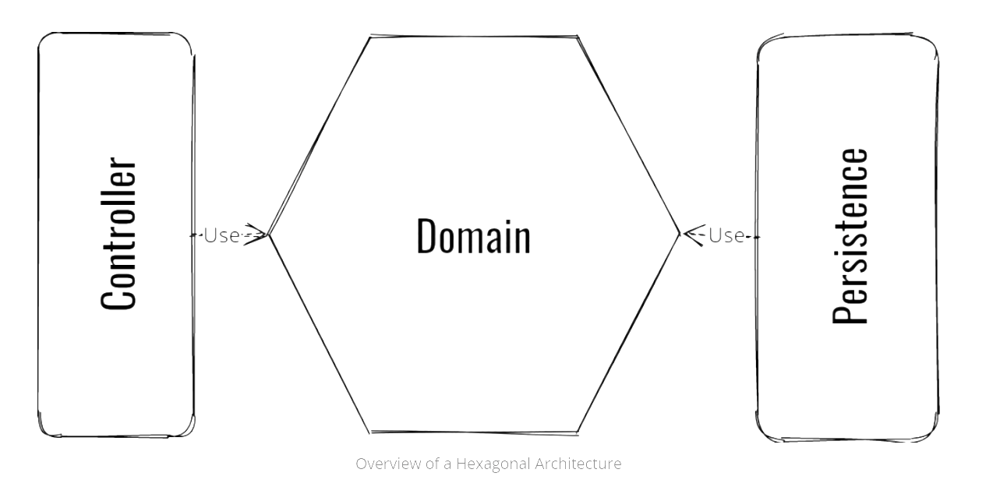

# 🔐 Binnacle Backend Showcase

> A modern, modular backend system for managing security patrol operations — built with **Java 21**, **Spring Boot 3.5**, and **Spring Modulith**.

This public documentation serves as a **showcase** of the backend architecture and features of the private `binnacle-backend` project. No source code is included here.

---

## 📖 What is Binnacle?

Binnacle is a backend platform designed for **security companies** and **residential communities** to efficiently manage their operations. It supports real-time patrol tracking, incident reporting with images, and role-based guard management.

---

## ✨ Key Features

- **Security Rounds Management** – Start/end patrols, track states and duration
- **Incident Reporting** – Include images and descriptions with presigned S3 URLs
- **Check-In/Check-Out** – Guard activity tracking with device metadata
- **Urbanization & Route Management** – Organize neighborhoods and patrol paths
- **User & Guard Roles** – JWT-secured role-based access control
- **Notifications** – Email/SMS alerts via AWS SNS for critical events
- **Statistics & Analytics** – Time-based metrics (daily, monthly, etc.)
- **Cloud Integration** – AWS S3 (storage) + SNS (messaging)
- **API-first Design** – Swagger-based REST API documentation
- **Spring Modulith** – Enforced modular boundaries between domains

---

## 🧱 Architecture Overview

Binnacle applies **Hexagonal Architecture ** and **DDD** using **Spring Modulith**:

<p align="center">
  
</p>


```
binnacle-backend/
├── src/main/java/com/clerodri/binnacle/
│   ├── [module]/
│   │   ├── domain/              # Business logic (hexagon core)
│   │   │   ├── api/             # Input ports (use cases)
│   │   │   ├── spi/             # Output ports (repositories)
│   │   │   └── *Service.java    # Domain services
│   │   ├── infra/               # Infrastructure adapters
│   │   │   ├── controller/      # REST controllers (input adapter)
│   │   │   ├── persistence/     # JPA repositories (output adapter)
│   │   │   └── s3/              # AWS S3 integration
│   │   └── package-info.java    # Spring Modulith module definition
```

**Key Architectural Features**:

1. **Spring Modulith**: Enforces modular boundaries and dependencies between modules
   - Each module is self-contained with explicit dependencies
   - Example: `@ApplicationModule(allowedDependencies = {"common", "urbanization :: api"})`

2. **Hexagonal Architecture Layers**:
   - **Domain Layer**: Pure business logic, framework-agnostic
   - **API Layer**: Input ports defining use cases
   - **SPI Layer**: Output ports for external dependencies
   - **Infrastructure Layer**: Adapters for databases, REST, AWS, etc.

3. **Event-Driven Communication**:
   - Modules communicate via Spring Modulith events
   - Example: `RondaNotification` and `ReportEventNotification` events
   - Asynchronous event handlers for notifications

4. **Domain-Driven Design**:
   - Rich domain models with business logic
   - Value objects and entities with validation
   - Factory patterns for complex object creation
   - Strategy pattern for statistics calculation
	 

	 
## 🧰 Technology Stack

| Category      | Tools Used                                     |
|---------------|------------------------------------------------|
| Language      | Java 21                                        |
| Core Framework| Spring Boot 3.5, Spring Modulith 1.4.0-RC1     |
| Auth & Security| Spring Security + JWT (Auth0 Java JWT)       |
| Persistence   | PostgreSQL + Spring Data JPA + Flyway          |
| Cloud         | AWS S3 (image uploads), SNS (notifications)    |
| Docs          | SpringDoc OpenAPI + Swagger UI                 |
| Testing       | JUnit 5, Mockito, Spring Modulith Test         |
| Dev Tools     | Lombok, Maven, AssertJ                         |

📄 Details in [`architecture/tech_stack.md`](architecture/tech_stack.md)


### API Documentation
- **SpringDoc OpenAPI 2.7.0** - Automated API documentation (Swagger UI)
		The backend exposes a secured REST API.


| Method | Path                    | Description                    |
|--------|-------------------------|--------------------------------|
| POST   | `/round`                | Start a new security round     |
| PUT    | `/round/{id}/finish`    | Finish a patrol round          |
| POST   | `/round/event`          | Submit an incident report      |
| GET    | `/round?page=1`         | List patrol rounds             |

🟡 **TODO: Add Swagger UI screenshot**
> Place it under: `screenshots/swagger-ui.png`


## 🧪 Test Coverage & Strategy

- ✅ Unit tests (domain services, use cases)
- ✅ Module tests using Spring Modulith
- ✅ Integration tests with MockMvc


## 🧑‍💻 Author

**Ronaldo Rodriguez**  
📧 [ronaldo_hm95@hotmail.es]   
🔗 [LinkedIn](https://linkedin.com/in/clerodri)

---

## 🪪 License

This project is under the **MIT License**.  
Only documentation is available here. Source code is **private**.
